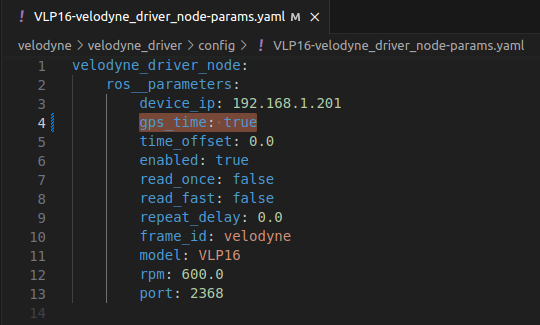
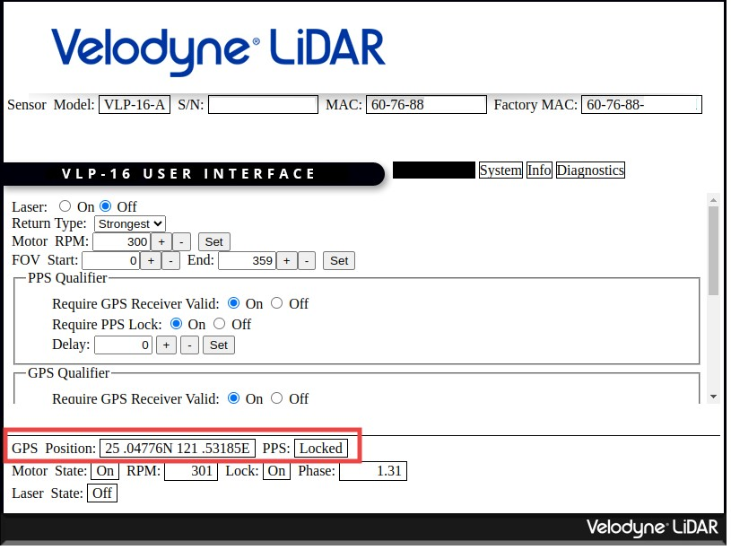
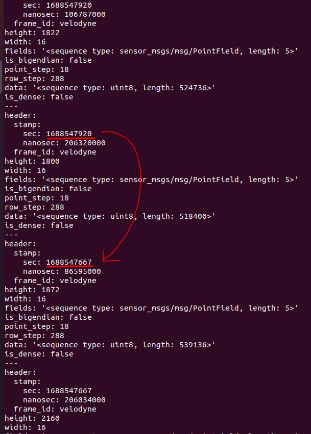
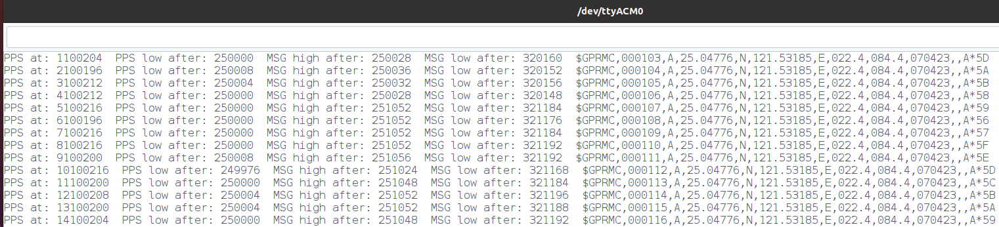

# arduino_pps_gprmc_time_sync

Use Arduino Uno to simulate a GPS module, sending PPS pulse and GPRMC message to Lidar.

## Verified Platform
- Arduino Uno
- Velodyne Lidar VLP-16 
- ROS 2 Foxy with VLP-16 driver https://github.com/ros-drivers

## Wiring Connection

|  VLP-16   | Arduino  |
|  ----  | ----  |
| Ground  | GND |
| GPS PULSE  | Pin#8 |
| GPS RECEIVE  | Pin#11 |

## VLP-16 Configuraition

Make sure the parameter `gps_time` in yaml file is set to **true** to enable time sync.

## Test Result

- VLP-16 web interface

It is successfully synchronized if you see the coordinates of **GPS Position**  and locked **PPS** status.

- VLP-16 ROS 2 timestamp

If the `gps_time` parameter is set, then you will see the time jump after time synchronized.

- GPRMC debug message

You can enable the debug messages in Arduino code to monitor the GPRMC.

## Note

If Arduino is connected to other device and the UART data is not readable, please consider to change the `inverse_logic` to `false`.
https://github.com/Adlink-ROS/arduino_pps_gprmc_time_sync/blob/46b20be58a1bf732323bd96396a94d01cb6a8e1c/src/pps_gprmc_time_sync/pps_gprmc_time_sync.ino#L7
